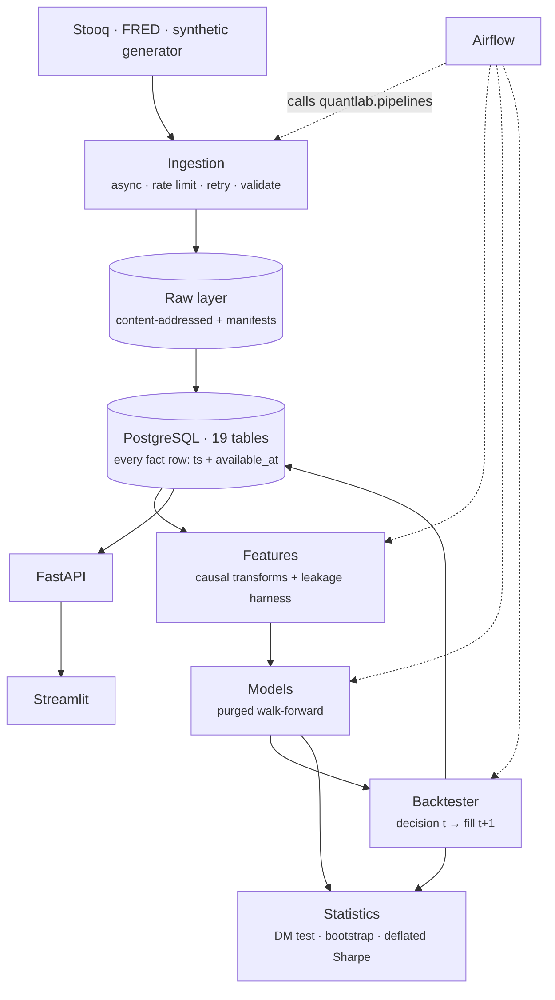
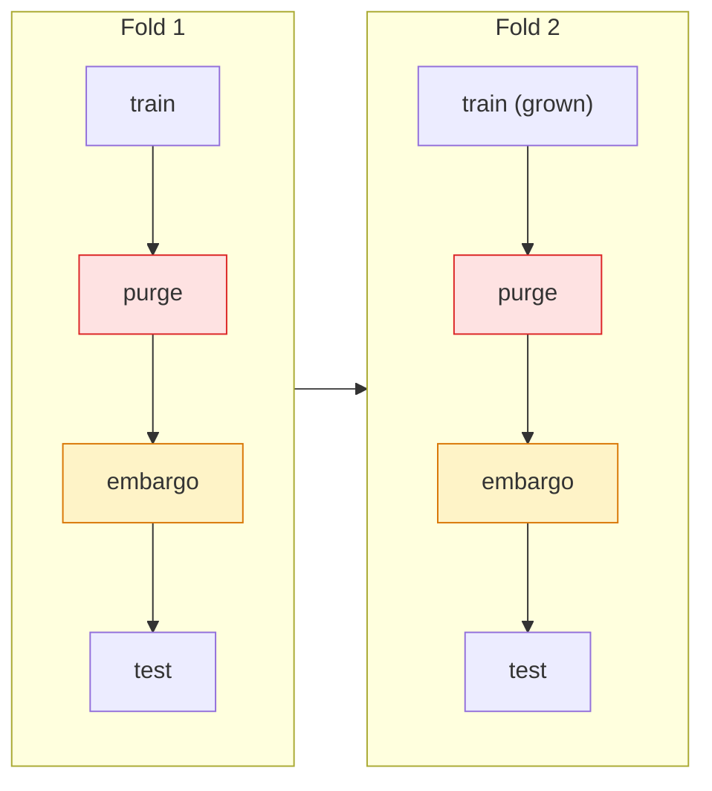

# quantlab

A financial data research and quantitative backtesting platform, built to
answer one question honestly:

> **Do machine-learning models provide statistically and economically meaningful
> improvements over simple statistical baselines for financial time-series
> prediction, after realistic transaction costs?**

The current offline run finds **no statistically supported ML improvement**.
A separate S&P 500 close-only pilot finds no supported ML improvement over a
zero-return forecast, but it does not test trading returns or costs.

```
19-table schema · point-in-time data controls · walk-forward evaluation · offline research example
```

---

## Contents

- [The problem](#the-problem)
- [The idea the system is built around](#the-idea-the-system-is-built-around)
- [Results](#results)
- [Real-market pilot](#real-market-pilot)
- [Architecture](#architecture)
- [How bias is prevented](#how-bias-is-prevented)
- [Machine-learning evaluation](#machine-learning-evaluation)
- [Backtesting assumptions](#backtesting-assumptions)
- [Installation](#installation)
- [Usage](#usage)
- [Repository structure](#repository-structure)
- [Testing](#testing)
- [Limitations](#limitations)
- [Further reading](#further-reading)

---

## The problem

Most published claims that machine learning predicts asset returns share a small
set of methodological faults: a random train/test split on a time series, a
feature that quietly reads the future, a backtest that fills at the price which
generated the signal, and a headline Sharpe ratio reported as though only one
configuration had ever been tried.

Each of those inflates results in the favourable direction. None is visible in
the output. A backtest with look-ahead bias does not crash; it produces a
beautiful equity curve.

This platform is built so that those faults are hard to commit and easy to
detect. The research question above is the thing it is pointed at, but the
transferable part is the machinery: an ingestion layer with a real availability
model, a backtester whose temporal contract is enforced at four independent
layers, a leakage detector that catches eight deliberately-broken feature
functions, and an evaluation layer that reports what a result is worth after
correcting for how many things were tried.

## The idea the system is built around

Every fact row in the database carries **two** timestamps.

| Column | Meaning | Example |
|---|---|---|
| `ts` | The instant the observation *describes* | `2024-03-05T00:00Z` |
| `available_at` | The earliest instant it could have been *known* | `2024-03-05T21:00Z` |

For a price bar the gap is hours. For January CPI it is six weeks. Treating the
two as the same thing is the single most common cause of look-ahead bias, and
separating them turns *"did I peek at the future?"* from a code-review question
into a query predicate:

```sql
WHERE available_at <= :decision_time
```

Everything downstream follows from this. Features filter on it. The backtester
filters on it. The API exposes it as an `as_of` parameter, so you can ask the
system what a researcher standing on any past date could have seen. The database
enforces `CHECK (available_at >= ts)`, so a loader bug cannot create a row
claiming to have been knowable before the period it describes.

## Results

> **These numbers come from the synthetic generator, not from market data.**
> This reproducible example uses four seeded synthetic series
> (2012-2023, 11,508 observations, 24 features). One series carries an injected
> AR(1) component so the pipeline has known signal to find. The commands to
> run on real data are in [Usage](#usage). This is not a market result.

### Forecast accuracy

Walk-forward evaluation, five expanding folds, identical folds for every model.
`r2_oos_vs_zero` is the Campbell-Thompson out-of-sample R² against a zero
forecast; **at or below zero means the model is not beating a prediction of no
change.**

| Model | Kind | RMSE | R²_OOS vs zero | Info. coefficient | Directional accuracy |
|---|---|---:|---:|---:|---:|
| `zero` | baseline | 0.016693 | 0.00000 | — | — |
| `historical_mean` | baseline | 0.016677 | +0.00188 | 0.0034 | 51.5% |
| `last_value` | baseline | 0.023046 | -0.90609 | 0.0441 | 51.5% |
| `ridge` | ML | 0.016768 | -0.00912 | -0.0461 | 51.9% |
| `elastic_net` | ML | 0.016675 | +0.00212 | 0.0153 | 52.2% |
| `random_forest` | ML | 0.016766 | -0.00877 | -0.0435 | 51.0% |
| `gradient_boosting` | ML | 0.017016 | -0.03914 | -0.0373 | 51.8% |

Three of the four machine-learning models have **negative** out-of-sample R².
They are worse than predicting nothing.

### Statistical significance

The test first averages the paired squared-loss difference across assets for
each date. It then uses 1,260 dates, not 5,040 correlated asset-date pairs, for
the Diebold-Mariano statistic with seven HAC lags. P-values are corrected
across models with Benjamini-Hochberg. `favours = a` means lower model loss.

| Model | DM statistic | Adjusted p | Favours | Beats baseline at 5% |
|---|---:|---:|:--:|:--:|
| `historical_mean` | -2.796 | 0.0105 | a | yes (a baseline, not ML) |
| `elastic_net` | -1.767 | 0.0774 | a | no |
| `ridge` | +2.825 | 0.0105 | b | **significantly worse** |
| `random_forest` | +2.106 | 0.0425 | b | **significantly worse** |
| `gradient_boosting` | +2.475 | 0.0202 | b | **significantly worse** |
| `last_value` | +12.244 | <0.0001 | b | **significantly worse** |

No ML model beats the zero forecast significantly. Three have significantly
higher loss in this synthetic run. This result does not establish how those
models perform on market data.

### Economic significance, after realistic costs

$0.005/share commission with a $1 minimum, 5bp slippage, daily rebalancing,
participation capped at 5% of volume. Every strategy uses the same out-of-sample
window, 2019-03-01 to 2023-12-28.

| Strategy | Kind | Annual return | Sharpe | Max drawdown | Turnover/yr | Trades |
|---|---|---:|---:|---:|---:|---:|
| **`buy_and_hold`** | reference | **+25.6%** | **1.733** | -17.5% | 0.46 | 28 |
| `elastic_net` | ML | +23.3% | 1.652 | -14.8% | 58.9 | 1,474 |
| `historical_mean` | baseline | +25.6% | 1.733 | -17.5% | 0.46 | 28 |
| `last_value` | baseline | +21.9% | 1.361 | -25.0% | 165.1 | 2,231 |
| `ts_momentum` | reference | +15.4% | 1.206 | -18.0% | 10.6 | 226 |
| `ma_crossover` | reference | +13.5% | 1.148 | -12.4% | 3.5 | 80 |
| `ridge` | ML | +11.4% | 0.855 | -19.8% | 98.6 | 1,796 |
| `random_forest` | ML | +10.4% | 0.886 | -16.7% | 49.0 | 1,281 |
| `gradient_boosting` | ML | +9.5% | 0.806 | -15.4% | 78.5 | 1,628 |

Read the turnover column next to the Sharpe column. Buy-and-hold turns over
about 0.46 times a year. Ridge turns over about 98.6 times and its Sharpe is
lower after costs. Removing costs raises the average model Sharpe by 0.31 in
this run.

### What the best result is actually worth

| | |
|---|---|
| Best strategy | `buy_and_hold` |
| Observed Sharpe (annualised) | 1.733 |
| Bootstrap 95% interval | **[0.74, 2.74]** |
| Probabilistic Sharpe ratio | 99.995% |
| **Deflated** Sharpe, 9 configurations tried | **99.54%** |
| Minimum track record for 95% confidence | 0.89 years |

This confidence interval describes one synthetic run with built-in upward
drift. It is not evidence of a tradable market edge.

### The verdict, generated by the code

> One model achieved a positive out-of-sample R², but no model's improvement over
> the zero baseline was statistically significant under a Diebold-Mariano test
> with Benjamini-Hochberg correction. The apparent edge is within sampling noise.

That sentence is written by `_build_verdict` in `research_run.py` from the
numbers above. It has branches for every outcome including a positive one; there
is no path in the code that suppresses a negative result.

### Validating the validator

The result above is only believable because the pipeline is tested in both
directions on data whose answer is known
(`tests/integration/test_research_loop.py`):

| Input | Requirement | Result |
|---|---|---|
| Series with injected AR(1), ρ=0.25 | IC > 0.10, R²_OOS > 0.01, directional accuracy > 53% | passes |
| Pure random walk | \|IC\| < 0.06, R²_OOS ≤ 0.01, directional accuracy 46-54% | passes |

A system that reports signal on a random walk is leaking. One that finds nothing
in the AR(1) series is broken. Passing both is what makes a negative result on
real data mean something.

## Real-market pilot

On 2026-09-27, a separate close-only forecast pilot used the S&P 500 daily
price index downloaded from FRED. The raw CSV snapshot, SHA-256 checksum,
fold boundaries and full results are saved locally under
`data/artifacts/real-market-pilot-2026-09-27/`, which is gitignored. The
committed [`pilot report`](docs/real-market-pilot.md) records the results.
A fresh FRED download may differ from that snapshot, so it may not reproduce
the exact published numbers.

Five chronological folds produced 1,260 next-session return forecasts per
model. The historical-mean baseline had out-of-sample R² of +0.00162 against
predicting zero, but its adjusted p-value was 0.655. All four ML models had
negative out-of-sample R². This is evidence about forecast accuracy on this
one index sample, not a demonstrated trading edge.

FRED provides only daily closes for this series, and the index omits dividends.
This pilot therefore did **not** run the OHLCV backtester or estimate transaction
costs. Stooq returned a browser-verification page and Yahoo returned a rate-limit
response during the attempted ETF data fetch. The full real-data research study
remains outstanding.

## Architecture



The dotted lines matter. Airflow contains no business logic; DAG tasks are
one-line calls into `quantlab.pipelines`, which the CLI and the tests call too.
That is why every pipeline step is unit-testable and why a DAG failure can be
reproduced locally with one command.

Full detail, including the technology-choice table and layer responsibilities,
is in [`docs/architecture.md`](docs/architecture.md).

## How bias is prevented

| Bias | Mechanism | Where |
|---|---|---|
| **Look-ahead** | `available_at` on every row; point-in-time views; execution guard; DB CHECK constraints | `timeutils.py`, `pit.py`, `backtesting/execution.py`, `db/models.py` |
| **Feature leakage** | Causal-only transforms; a harness that corrupts the future and checks past values do not move | `features/transforms.py`, `features/guards.py` |
| **Bad train/test boundaries** | Purged, embargoed walk-forward; no shuffle option exists | `models/splitters.py` |
| **Overfitting** | Regularised defaults; fresh model per fold; scaler inside the pipeline; sklearn early stopping off | `models/sklearn_models.py`, `models/walkforward.py` |
| **Multiple testing** | Bonferroni, Benjamini-Hochberg, deflated Sharpe ratio | `research/multiple_testing.py` |
| **Survivorship** | Point-in-time universe membership with `valid_from`/`valid_to` | `db/models.py`, `db/repository.py` |
| **Timestamp misalignment** | UTC everywhere; naive datetimes rejected, not coerced; DST-aware session closes | `timeutils.py`, `db/base.py` |

### The four layers protecting the temporal contract

> A signal computed from information available at time *t* must never execute at
> a price that was unknowable at time *t*.

1. **Data.** Every row knows when it became public.
2. **Structure.** `PointInTimeFrame` physically contains only visible rows. A
   strategy cannot index into the future because the future is not in the object.
3. **Execution.** `ExecutionModel.execute` raises `LookAheadError` unless the
   fill bar is strictly after the decision bar. There is deliberately no
   `SAME_CLOSE` timing option; the bug is unexpressible, not merely discouraged.
4. **Storage.** `CHECK (execution_ts > decision_ts)` on `orders` and `trades`.

A bug must defeat all four to produce a wrong number.

### The leakage harness

Compute features on the full history. Corrupt everything after a cut point.
Recompute. If any value at or before the cut moved, the feature read the future.
It assumes nothing about *how* a feature is implemented, so it catches what a
code review misses. Eight deliberately-broken functions are checked in and must
all be caught:

`rolling(center=True)` · whole-sample z-score · `bfill()` · `interpolate(limit_direction="both")` · `shift(-1)` · min-max scaling on the full sample · reversed rolling window · reversed expanding mean

Four correct functions must pass. The production feature library is checked on
every CI run.

> Building this harness surfaced a real finding worth recording: an earlier
> version produced false positives on `rolling().skew()`, and the cause was
> pandas mean-centring the entire array before the sliding computation for
> numerical stability. The head values were not reading the future; the library
> was re-centring. The artefact is reproduced in a test, so the reasoning behind
> the corruption model is checked rather than asserted in a comment.

## Machine-learning evaluation

**No random splitting exists anywhere in the codebase.** Not as a default, not
as a flag. A test asserts that splitters have no `shuffle` attribute, as a guard
against a future contributor adding one.



**Purging** drops training rows whose label became knowable after the test window
opened — with a 5-day forward return, the last week of training data resolves
inside the test set. **Embargo** drops a further gap, because serial correlation
means the rows just before a test window carry nearly the same information as the
rows inside it.

Both expanding-window and rolling-window splitters are provided, because which is
right is an empirical question about the data, not a settled one.

The model ladder is deliberately short and interpretable: `zero`,
`historical_mean`, `last_value`, `ridge`, `elastic_net`, `random_forest`,
`gradient_boosting`. Deep learning is absent on purpose — with a few thousand
daily observations and a signal-to-noise ratio near zero, extra capacity buys
overfitting, and the honest baseline comparison matters more than model
complexity.

## Backtesting assumptions

Stated so they can be argued with:

- Signals are computed at the close; orders fill at the **next** session's open
  (or close, configurable). Never at the signal bar's own price.
- Commission: per-share with a minimum and a notional cap, or basis points.
- Slippage: fixed half-spread, or half-spread plus square-root market impact.
- Orders are capped at a fraction of the bar's actual volume.
- One fill per order; no partial fills or order book.
- Shorts are allowed; **borrow costs are not modelled**.
- Cash earns nothing, which penalises strategies that sit in cash.
- The benchmark is buy-and-hold with entry costs applied once.
- The accounting identity `equity = cash + positions` is verified after **every
  bar** to a relative tolerance of 1e-9.

Full detail and the complete list of what the tests check is in
[`docs/backtesting.md`](docs/backtesting.md).

## Installation

### With Docker (recommended)

```bash
git clone <this-repository>
cd quant-platform

docker compose --profile demo up -d --build   # Postgres + migrations + demo data + API + dashboard
```

| Service | URL | Notes |
|---|---|---|
| API docs | http://localhost:8000/docs | OpenAPI, interactive |
| Dashboard | http://localhost:8501 | |
| PostgreSQL | `localhost:5432` | user/password/db: `quantlab` |

Add Airflow when you want it — it is behind a profile because it is three more
containers and ~2GB of image, and a reviewer reading the code should not have to
wait for a scheduler to boot:

```bash
docker compose --profile airflow up -d --build   # http://localhost:8080, airflow/airflow
```

Tear down with `make clean`.

### Without Docker

Python 3.10 or newer.

```bash
python -m venv .venv && source .venv/bin/activate
make install                      # pip install -e ".[api,dashboard,dev]"

cp .env.example .env              # then edit if you are not using the defaults
make migrate                      # alembic upgrade head
make seed                         # deterministic synthetic dataset, no network needed

make api                          # http://localhost:8000
make dashboard                    # http://localhost:8501
```

Everything except real data ingestion works with no network access. `make test`
and `make research-offline` need neither a database nor the internet.

## Usage

```bash
# --- data ------------------------------------------------------------------
quantlab ingest-prices                    # the demo ETF universe from Stooq
quantlab ingest-prices spy.us tlt.us      # specific tickers
quantlab ingest-macro                     # FRED series
quantlab returns                          # trailing and forward returns
quantlab validate                         # warehouse data-quality checks
quantlab status                           # row counts per table

# --- research --------------------------------------------------------------
quantlab features                         # build and store the feature set
quantlab train                            # walk-forward the model ladder
quantlab backtest                         # the classical strategy set

make research                             # the full study, writes RESEARCH_REPORT.md
make research-offline                     # same, on synthetic data, no database

# Close-only real-market pilot; choose a new output directory each run.
curl -L 'https://fred.stlouisfed.org/graph/fredgraph.csv?id=SP500' -o /tmp/SP500.csv
python scripts/run_real_market_pilot.py /tmp/SP500.csv data/artifacts/sp500-pilot-new

# --- development -----------------------------------------------------------
make test                                 # full test suite
make test-leakage                         # just the look-ahead suite
make check                                # lint + typecheck + test, what CI runs
```

The research study writes `data/artifacts/RESEARCH_REPORT.md` and
`research_results.json`. Every number in the report comes from that run; nothing
is hand-edited.

### A worked example

```python
from quantlab.backtesting import (
    BacktestEngine,
    EngineConfig,
    ExecutionModel,
    MarketData,
    MovingAverageCrossover,
    build_result,
)
from quantlab.backtesting.costs import CostModel, FixedBpsSlippage, PerShareCommission
from quantlab.db import repository as repo
from quantlab.db.session import session_scope

with session_scope() as session:
    prices = repo.load_prices(session, ["SPY.US", "TLT.US"])

engine = BacktestEngine(
    EngineConfig(
        initial_cash=1_000_000.0,
        execution=ExecutionModel(costs=CostModel(PerShareCommission(), FixedBpsSlippage(5.0))),
        rebalance="weekly",
        benchmark_symbol="SPY.US",
    )
)
result = build_result(engine.run(MovingAverageCrossover(["SPY.US", "TLT.US"]), MarketData(prices)))
print(result.metrics.to_dict())
```

## Repository structure

```
quant-platform/
├── src/quantlab/
│   ├── config.py                  Typed settings, one source of truth
│   ├── timeutils.py               ★ The availability model lives here
│   ├── pit.py                     ★ Point-in-time views that cannot see the future
│   ├── exceptions.py              Typed hierarchy; nothing is swallowed
│   ├── pipelines.py               ★ Every pipeline step; Airflow and the CLI both call these
│   ├── research_run.py            ★ The research study, end to end
│   ├── db/                        Schema, migrations, repository, Decimal/float boundary
│   ├── ingestion/                 Provider interface, async HTTP, raw layer, validation
│   │   └── providers/             stooq · fred · synthetic
│   ├── features/                  Causal transforms, feature library, ★ leakage guards
│   ├── models/                    Model interface, ★ purged splitters, walk-forward, tracking
│   ├── backtesting/               ★ Engine, execution guard, costs, portfolio, metrics
│   ├── research/                  Descriptive, stationarity, regression, ★ hypothesis tests
│   ├── risk/                      VaR, CVaR, covariance shrinkage, optimisation
│   ├── api/                       FastAPI: 21 endpoints, as_of aware
│   └── dashboard/                 Streamlit, reads through the API
├── dags/                          Airflow: schedules only, no logic
├── tests/
│   ├── unit/                      Fast, no external dependencies
│   ├── integration/               Real database, real pipelines
│   └── leakage/                   ★ Look-ahead and data-snooping regression tests
├── migrations/                    Alembic
├── docker/                        Application and Airflow images
├── docs/                          Architecture, pipeline, backtesting, methodology, ADRs
└── scripts/                       run_research.py
```

★ marks the files worth reading first; `PROJECT_STATUS.md` has a suggested
reading order.

## Testing

```
Latest local run: 558 passed, 1 skipped (Python 3.12, 2026-09-28).
Coverage was not measured in that run.
Ruff lint and format checks and mypy pass locally on Python 3.12.
The Python 3.10 and PostgreSQL CI jobs have not been run on GitHub for this
working tree; see `PROJECT_STATUS.md`.
```

| Suite | What it covers |
|---|---|
| `tests/unit/` | Timestamp normalisation, causal transforms, costs, portfolio accounting, metrics, sizing, HTTP retry, provider parsers, model interface, statistical utilities, risk, DAG conventions, dashboard helpers |
| `tests/integration/` | Database constraints, migration-vs-ORM parity, ingestion end to end, the API against a seeded database, the full research loop |
| `tests/leakage/` | Temporal execution ordering, the leakage harness against eight broken and four correct functions, splitter purging and embargo |

The tests that matter most are the ones that try to break the system:

- Constructing an order that fills on its own decision bar → `LookAheadError`.
- A strategy reaching past its as-of instant → `LookAheadError`.
- A price gapping overnight after a signal → the strategy earns nothing from it,
  **and** the complementary test confirms an earlier signal does capture it, so
  the first test cannot be passed by an engine that never trades.
- A position moved without a matching cash flow → the accounting identity fails.
- Predictions without an `available_at` column → refused.
- Predictions stamped a year late → never acted on.
- A model finding signal in a random walk → would fail the research-loop test.

## Limitations

The ones that cannot be fixed with freely available data, stated plainly:

1. **Price returns, not total returns.** Stooq gives one close series, split
   adjusted. Dividend adjustment is not assumed, so returns understate total
   return by roughly the dividend yield. Comparisons can also change when
   strategies have different exposures.
2. **Revised macro data.** The free FRED endpoint returns the latest vintage, not
   the first release. The publication-lag model fixes the timing, not the values.
   ALFRED is the correct upgrade.
3. **Survivorship.** Delisted tickers are not downloadable. The point-in-time
   universe machinery exists and is tested; the data to populate it does not.
4. **Daily data only.** No intraday execution modelling.
5. **No borrow costs, margin interest, or interest on cash.**
6. **Limited samples.** The offline example uses synthetic data from 2012-2023.
   The real-market pilot uses one index over 2016-2026. Neither establishes a
   persistent market edge.
7. **The market-impact coefficient is a convention, not a calibrated estimate.**

Every one is expanded in [`docs/methodology.md`](docs/methodology.md).

The source code is under the [MIT License](LICENSE). The FRED market data is
not included in the repository.

## Further reading

| Document | Contents |
|---|---|
| [`PROJECT_STATUS.md`](PROJECT_STATUS.md) | What is done, what is partial, what remains, how to run everything, what to study first |
| [`docs/architecture.md`](docs/architecture.md) | Layers, dependency rules, technology choices |
| [`docs/data_pipeline.md`](docs/data_pipeline.md) | Ingestion stages, validation, incremental loading, macro joins |
| [`docs/backtesting.md`](docs/backtesting.md) | Bar ordering, costs, metrics conventions, what the tests check |
| [`docs/methodology.md`](docs/methodology.md) | Every bias, what is done about it, and the residual risk |
| [`docs/decisions/`](docs/decisions/) | Six ADRs on the decisions a reader might question |
| [`docs/example-research-report.md`](docs/example-research-report.md) | A generated study report, committed so you can read the output without running it |
| [`docs/real-market-pilot.md`](docs/real-market-pilot.md) | First close-only S&P 500 forecast pilot, with data and trading limitations |

---

*Built as a portfolio project. The offline synthetic example does not establish
a market result; the real-market pilot tests forecast accuracy, not trading
returns after costs.*
