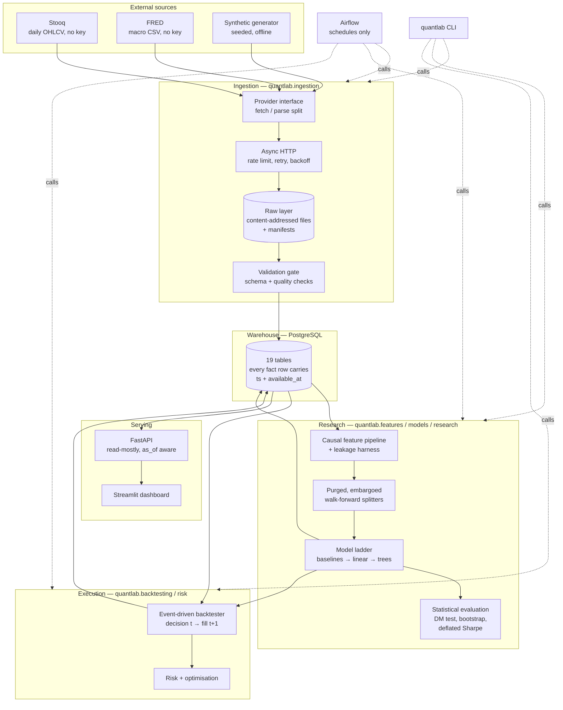
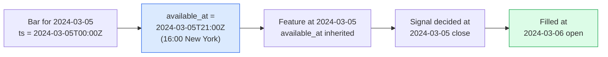

# Architecture

## The shape of the system



The dotted lines matter as much as the solid ones. Airflow and the CLI call the
same functions in `quantlab.pipelines`; neither contains logic of its own. That
is why every pipeline step is unit-testable and why a DAG failure can be
reproduced locally with one command.

## Layer responsibilities

| Layer | Package | Owns | Must not |
|---|---|---|---|
| Ingestion | `quantlab.ingestion` | Fetching, archiving, validating, loading | Compute features or derive research quantities |
| Storage | `quantlab.db` | Schema, migrations, upserts, the Decimal/float boundary | Contain analysis |
| Features | `quantlab.features` | Causal transforms, labels, leakage detection | Fit anything |
| Models | `quantlab.models` | The model interface, splitters, walk-forward, tracking | Know about strategies or costs |
| Backtesting | `quantlab.backtesting` | Orders, fills, portfolio state, costs, metrics | Fit models or fetch data |
| Research | `quantlab.research` | Statistical tests and corrections | Be imported by the pipeline hot path |
| Risk | `quantlab.risk` | VaR, CVaR, covariance, optimisation | Depend on the backtester |
| Serving | `quantlab.api`, `quantlab.dashboard` | Read access and presentation | Run long jobs |
| Orchestration | `dags/`, `quantlab.cli` | Schedules and dependency graphs | Contain business logic |

The dependency graph is acyclic and points inward: `api` depends on `db` and
`risk`; `backtesting` depends on `db` types but not on `models`; `models`
depends on `features` but not on `backtesting`. Predictions cross from `models`
to `backtesting` as a plain DataFrame with an `available_at` column, not as an
object, which keeps the two independently testable.

## Where the layout departs from the brief

The brief suggested top-level `ingestion/`, `database/`, `models/` and so on.
This repository puts them under `src/quantlab/` instead.

*Why.* Top-level packages mean the import path depends on the current working
directory, which works in a notebook and breaks in Airflow, in a container and
under pytest's rootdir handling. An installed package gives one import path that
is identical everywhere: `pip install -e .` in development, a wheel in the
Docker image, `PYTHONPATH=/opt/quantlab/src` in the Airflow image. The `src`
layout additionally prevents the classic accident where tests import the local
directory instead of the installed package and pass against code that was never
packaged.

The subdirectory names are otherwise the ones the brief asked for.

## Request and job paths

```mermaid
sequenceDiagram
    participant S as Airflow scheduler
    participant P as quantlab.pipelines
    participant PR as Provider
    participant R as Raw layer
    participant DB as PostgreSQL

    S->>P: run_price_ingestion()
    P->>DB: watermark per symbol
    DB-->>P: max(ts) - overlap
    P->>PR: fetch(symbol, from, to)  [async, rate limited]
    PR-->>P: raw bytes
    P->>R: write content-addressed file + manifest
    P->>P: parse (pure) → validate → dedupe
    alt quality gate fails
        P->>DB: record failed checks
        P-->>S: raise; nothing loaded
    else passes
        P->>DB: INSERT ... ON CONFLICT DO UPDATE
        P->>DB: ingestion_runs row with watermark
        P-->>S: summary
    end
```

Retrying any step converges to the same database state: the raw layer is
content-addressed, the loads are upserts on natural keys, and the resume point
comes from the database rather than from the scheduler's execution date.

## Technology choices

| Choice | Alternatives considered | Why this one |
|---|---|---|
| PostgreSQL | SQLite, DuckDB, Parquet only | Constraints are the point. `CHECK (available_at >= ts)` and `CHECK (execution_ts > decision_ts)` enforce the project's central claims at the storage layer, where no application bug can bypass them. DuckDB is faster for analytics but has weaker constraint support and no concurrent writers. |
| SQLAlchemy 2.0 + Alembic | Raw SQL, Django ORM | Typed models keep the API honest, and migrations are part of the deliverable. CI fails if the ORM and the migrations disagree. |
| Stooq + FRED + synthetic | yfinance, Alpha Vantage, Tiingo | No API key, no scraping, no ToS grey area. The synthetic provider makes CI deterministic and offline. |
| Event-driven backtester | Vectorised `signal.shift(1)` | Auditability. A vectorised backtest's correctness rests on one `shift` nobody can verify by reading; the loop lets a reader follow one order from decision to fill. Slower, and worth it for a project whose claim is temporal correctness. |
| Airflow | Prefect, Dagster, cron | The brief asked for it, and its sensor and backfill semantics fit the daily-batch shape. Behind a compose profile so it is optional for a reviewer. |
| FastAPI | Flask, Django REST | Pydantic v2 validation and automatic OpenAPI, both of which this API leans on. |
| Streamlit | Dash, React | The brief said not to spend effort on UI. Streamlit turns a page of Python into a working dashboard. |
| JSON manifests + DB rows + content hashes | MLflow, W&B | Reproducibility rests on four hashes (feature spec, model config, data fingerprint, seed), not on a server handing out run IDs. One fewer service in compose, and the property is checkable by anyone with the repository. |
| scikit-learn `HistGradientBoosting` | XGBoost required | Ships with scikit-learn, so the base install needs no extra dependency. XGBoost is available behind an extra. |

## Data flow with the availability model



Every arrow moves strictly forward in knowable time. The engine asserts the last
step on every fill and the database enforces it with a constraint. See
[`methodology.md`](methodology.md) for the full argument and
[`backtesting.md`](backtesting.md) for the engine's bar ordering.
