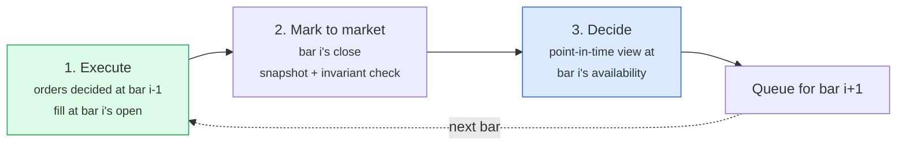

# Backtesting engine

## The rule the whole engine exists to enforce

> A signal computed from information available at time *t* must never be
> executed at a price that was unknowable at time *t*.

Everything below follows from that sentence.

## Bar ordering

For each bar `i` on the timeline, in this exact order:



Steps 1 and 3 are separated by step 2 for a reason: it makes it structurally
impossible for a decision taken at bar `i` to be filled at bar `i`'s price. The
queue only ever moves forward.

## Four independent controls

The temporal claim is not defended by one mechanism but by four, at different
layers, so that a bug has to defeat all of them to produce a wrong number.

| Layer | Control | What it catches |
|---|---|---|
| Data | `available_at` column on every fact row | Consuming an observation before it was published |
| Structure | `PointInTimeFrame` physically holds only visible rows | A strategy indexing into the future |
| Execution | `ExecutionModel.execute` raises unless `bar.ts > order.decision_ts` | Filling at the signal bar's own price |
| Storage | `CHECK (execution_ts > decision_ts)` on `orders` and `trades` | Anything the first three missed, at write time |

There is deliberately **no** `SAME_CLOSE` execution timing. Filling at the price
that generated the signal is the canonical look-ahead bug, so the engine makes it
unexpressible rather than merely discouraged.

## Execution timing

| Timing | Fills at | Models |
|---|---|---|
| `NEXT_OPEN` (default) | The following session's open | A strategy that computes signals after the close and submits at the next open |
| `NEXT_CLOSE` | The following session's close | An execution algorithm working the order through the day |

## What a strategy can see

A strategy receives a `DecisionContext` and returns target portfolio weights. It
cannot see the future, because everything reachable from the context is a
point-in-time view built at the decision instant. It also cannot place an order
directly, so it cannot choose its own execution price; the engine owns that.

Returning **weights** rather than share counts is deliberate: weights are
scale-free, so the same strategy runs on any portfolio size, and sizing and
execution policy can be varied without touching the alpha logic.

```python
class MyStrategy(Strategy):
    def warmup_bars(self) -> int:
        return 100  # no trading until this much history exists

    def on_bar(self, ctx: DecisionContext) -> Sequence[TargetWeight]:
        closes = ctx.recent("SPY.US", 100)  # numpy array, visible history only
        if closes[-1] > closes.mean():
            return [TargetWeight("SPY.US", 1.0, "above average")]
        return [TargetWeight("SPY.US", 0.0, "below average")]
```

Attempting to read past `ctx.as_of` raises `LookAheadError`. There is a test that
does exactly that and asserts the raise.

## Cost model

Three components, modelled separately because they behave differently.

**Commission** — an explicit fee. `PerShareCommission` matches the US retail
shape (cents per share, per-order minimum, capped as a share of notional);
`PercentCommission` matches basis-points-of-notional pricing.

**Slippage** — the gap between reference and fill price for reasons other than
your own size. Bid-ask spread lives here. `FixedBpsSlippage` is the simplest
defensible model.

**Market impact** — the price move your own order causes.
`SquareRootImpactSlippage` uses

```
impact = coefficient * volatility * sqrt(participation)
participation = |quantity| / bar_volume
```

The square-root form is the standard empirical result: doubling order size less
than doubles impact. The coefficient is a free parameter; the default of 1.0
with daily volatility is a conventional starting point, **not a calibrated
estimate**, and the code says so.

The sign convention is enforced in one place: a buy always fills at or above the
reference price, a sell at or below. Getting this backwards turns costs into a
source of alpha, and there is a test for each direction.

## Position sizing

Separate from strategy logic, because sizing is a risk decision, not an alpha
decision. Being able to swap it independently is what lets you ask whether a
strategy's edge is in the signal or in the sizing.

- `TargetWeightSizer` — straight `weight * equity / price`, with whole-share
  rounding **toward zero** so rounding never increases exposure beyond target.
- `VolatilityTargetSizer` — scales each position so its standalone risk hits a
  volatility target, with a leverage cap. The volatility estimate is
  point-in-time; the engine computes it from bars available at the decision.

Both cap orders at a fraction of the bar's volume. A backtest that buys 40% of a
day's volume is not describing a trade anyone could have made.

## Portfolio accounting

The identity `equity == initial_cash + realised_pnl + unrealised_pnl -
commission` is checked after **every bar**, to a relative tolerance of 1e-9.

That check has caught more bugs during development than any unit test: a
mis-signed short, a commission charged twice, a fill applied to a position
without a matching cash movement all break it immediately. It is a hard error,
not a warning.

Position averaging uses the weighted-average method and resets `avg_cost` when
the position flips sign, which is the convention that makes realised P&L on a
long-to-short reversal come out right. There is a test for the flip case.

## Metrics

Every definition is written out in `quantlab.backtesting.metrics` rather than
imported, because the details are where backtests disagree and an interviewer is
entitled to ask which convention you used.

| Metric | Convention chosen | The alternative, and why not |
|---|---|---|
| Annualised return | Geometric (CAGR), from wall-clock span | The arithmetic mean overstates what an investor compounds |
| Annualised volatility | `std * sqrt(periods_per_year)` | Exact only for iid returns; used for comparability, caveat recorded |
| Sharpe | Excess over a per-period risk-free rate | — |
| Sortino | Downside deviation over periods *below* the MAR | Averaging squared shortfalls over all periods gives a bigger denominator and a smaller ratio |
| Max drawdown | On the equity curve itself | Computing it on resampled cumulative returns understates it |
| Turnover | Mean per-period traded notional / equity, annualised | Definitions differ by a factor of two across the industry; ours counts each side |

## Benchmark

Buy-and-hold in one symbol, bought at the first bar it trades, with entry costs
applied once. A benchmark charged daily rebalancing costs would be unfairly
weak; one charged nothing would be unfairly strong. A single entry cost matches
what an investor buying the ETF would actually pay.

## What the tests check

`tests/unit/test_backtest_engine.py` and `tests/leakage/test_temporal_execution.py`:

- **Closed-form arithmetic.** A three-bar hand-computed example whose expected
  equity is derived in the docstring; buy-once-and-hold matched exactly against
  `cash + N * last_close`.
- **The overnight gap test.** Prices are flat at 100 through bar 3, then gap to
  200 overnight into bar 4. A strategy deciding at bar 3 fills at bar 4's open of
  200 and earns nothing. An engine that filled at bar 3's close of 100 would
  double its money instantly. The complement is also tested: deciding at bar 2
  *does* capture the gap, so the first test cannot be passed by an engine that
  simply never trades.
- **Direct guard tests.** Constructing an order whose `decision_ts` equals the
  execution bar's `ts` raises `LookAheadError`.
- **Cost accounting.** Commission reduces cash by exactly the fee; slippage moves
  the fill price against the order in both directions; a flat market with costs
  loses exactly the costs.
- **Context isolation.** On bar `i` the strategy sees exactly `i+1` bars, and
  reaching past the as-of instant raises.
- **Prediction availability.** Predictions without an `available_at` column are
  refused; predictions stamped a year late are never acted on.
- **Housekeeping.** Duplicate bars rejected, participation caps enforced, orders
  for a symbol that did not trade stay pending rather than being dropped.

## Performance note

The first working version of the engine rebuilt a point-in-time view of the
whole panel on every bar. That is `O(n)` per bar and `O(n²)` over a run; on a
three-symbol, fifteen-year panel a single backtest took several minutes.

This mattered for correctness, not just speed. When the safe path is slow,
researchers stop using it and start hand-rolling vectorised shortcuts — exactly
the behaviour this project exists to prevent.

The fix kept the guarantee and dropped the cost. Availability is monotone within
a symbol, so the visible set at any instant is a *prefix* of that symbol's sorted
rows and its length is one binary search. `PointInTimeFrame.from_visible_prefix`
re-validates the boundary rather than trusting it, so the safety property is
unchanged. Measured: 19.1s to 1.75s on the same run, with byte-identical results.

## Known limitations

- **One fill per order.** No partial fills or order books. Realistic for daily
  bars, wrong for intraday.
- **No borrow costs or margin interest.** Short positions are free to hold, which
  flatters long-short strategies.
- **No corporate actions beyond price adjustment.** Splits and dividends are
  assumed to be in the adjusted series; see the Stooq caveat in
  [`methodology.md`](methodology.md).
- **Cash earns nothing.** An uninvested portfolio should earn the risk-free rate;
  it does not here, which penalises strategies that sit in cash.
- **The impact coefficient is not calibrated.** It is a plausible default, not an
  estimate from execution data.
