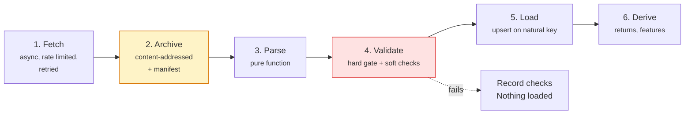

# Data pipeline

## Two timestamps, everywhere

Every fact row in this system carries two timestamps.

| Column | Meaning | Example |
|---|---|---|
| `ts` | The instant the observation *describes* | `2024-03-05T00:00Z` for the 5 March bar |
| `available_at` | The earliest instant it could have been *known* | `2024-03-05T21:00Z`, the New York close |

For a macro series the gap is large: January CPI has `ts = 2024-01-01` and
`available_at` in mid-February. Treating those two as the same thing is the
single most common cause of look-ahead bias, and separating them turns "did I
peek at the future?" from a code-review question into a SQL predicate:

```sql
WHERE available_at <= :decision_time
```

The database enforces `CHECK (available_at >= ts)` on `prices`, `returns`,
`features` and `economic_data`, so a loader bug cannot insert a row claiming to
have been knowable before the period it describes.

## Stages



### 1. Fetch

`quantlab.ingestion.http.AsyncHttpClient` handles the network. A token bucket
gives a short burst then settles to the sustained rate, which is how most public
endpoints actually police usage. Retries cover connection errors, timeouts, 5xx
and 429 only; a 404 is never retried, because hammering an endpoint that cannot
succeed is both rude and useless.

Backoff uses **full jitter** — `uniform(0, base * 2**attempt)` — rather than
plain exponential. Several symbols are fetched concurrently, and unjittered
backoff makes them retry in lockstep, reproducing the burst that triggered the
rate limit in the first place. `Retry-After` is honoured when the provider sends
it.

### 2. Archive before parsing

Raw bytes are written to disk *before* any interpretation, at
`data/raw/<provider>/<dataset>/<entity>/<YYYY-MM-DD>/<sha256[:16]>.<ext>`, with a
sidecar `.manifest.json` recording the request, fetch time, digest and size.

Three consequences:

- If the parser crashes, the bytes survive.
- Re-fetching identical bytes rewrites the same path, so the layer is idempotent
  by construction rather than by convention.
- A parser bug found six months later is fixed by a reparse, not by
  re-downloading data the provider may since have revised.

Blobs live on the filesystem rather than in PostgreSQL. The database stores the
path and the digest (`ingestion_runs.raw_path`, `payload_sha256`), which gives
provenance without putting megabytes of CSV in a relation and bloating the WAL.

### 3. Parse, as a pure function

Every provider implements two methods: `fetch` does I/O, `parse` is pure. That
split is deliberate. Parsing is where the subtle bugs live — column renames,
date formats, `'.'` for a missing value — and keeping it pure means every parser
is tested against a checked-in fixture with no network, deterministically, in
milliseconds.

Adding a provider means implementing those two methods and registering the
class. Nothing else in the system needs to change.

### 4. Validate: one hard gate, one soft one

**Hard gate** (`validate_schema`). Wrong columns or unparseable types stop the
pipeline. Loading a frame whose `close` column is a string is not a warning; it
is a bug that will silently produce nonsense returns.

**Soft checks** (`run_price_quality_checks`). Real market data has gaps,
zero-volume days and genuine 20% moves. Failing on every anomaly means the
pipeline never runs; recording them means a human can look. Each result is
written to `data_quality_checks`, so data quality is a queryable time series.

| Check | Severity | Rationale |
|---|---|---|
| `row_count` | fail | An empty payload is not a successful load |
| `no_duplicate_keys` | fail | Duplicates would double-count a session |
| `timestamps_increasing` | fail | Out-of-order rows break every rolling calculation |
| `availability_after_ts` | fail | The look-ahead invariant |
| `ohlc_consistency` | fail | `high < low` is impossible, not unusual |
| `positive_prices` | fail | A non-positive price breaks log returns |
| `missing_values` | warn | Some series genuinely have holes |
| `extreme_returns` | warn | A 50% move is usually an unadjusted split, sometimes a real event |
| `calendar_gaps` | warn | Weekends and holidays are normal; a two-week hole is not |

### 5. Load idempotently

`INSERT ... ON CONFLICT DO UPDATE` on the natural key. `prices` is unique on
`(asset_id, ts)`; `features` on `(feature_set_id, asset_id, name, ts)`.
Re-running a window overwrites rather than duplicating.

### 6. Derive

`materialise_returns` writes both trailing and forward returns with an explicit
`direction` column. A forward return's `available_at` is the availability of the
**last** price in its window, which is what stops a label leaking into the
feature set through a careless join.

## Incremental loading

The resume point comes from the database, not from Airflow's execution date:

```python
watermark = SELECT max(ts) FROM prices WHERE asset_id = :id
resume_from = watermark - overlap_days
```

The overlap matters. Providers revise recently published bars, and a strict
"everything after the watermark" rule would miss those corrections forever.
Re-reading the last five sessions each run picks them up, and the upsert makes
that free.

Because the watermark is a fact about the data rather than about the schedule, a
backfill, a retry and a normal run all converge to the same state.

## Feature computation

Features are computed with the causal primitives in
`quantlab.features.transforms`. The banned operations, and why:

| Operation | Why it leaks |
|---|---|
| `rolling(..., center=True)` | Half the window is in the future |
| `bfill()` | Fills a gap with a value not yet published |
| `interpolate(limit_direction="both")` | Same, smoothly |
| `(x - x.mean()) / x.std()` over the whole sample | The mean and standard deviation include the future |
| `min_periods < window` | Produces a different statistic than the column claims during warm-up |

`pct_change` is called with `fill_method=None` throughout. Pandas' historical
default forward-fills before differencing, which reports a 0% return across a
data gap instead of NaN — a missing observation should propagate as missing, not
as "the price did not move".

### Macro joins are the subtle part

Macro series are joined onto price bars with `merge_asof` on **`available_at`**,
not on `ts`:

```python
pd.merge_asof(prices, macro, on="available_at", direction="backward")
```

Concretely: on 15 February a model may use the January CPI print only if January
CPI had actually been released by then. Joining on observation date instead
hands the model the January number on 31 January, roughly two weeks before
anyone had it. That one join is the difference between a macro feature and a
time machine.

## Storage layout

```
data/
  raw/         immutable provider payloads, content-addressed, gitignored
  processed/   intermediate artefacts
  artifacts/   run manifests, research reports
```

All three are gitignored: they are reproducible outputs, and committing them
makes the repository large and the diffs meaningless.

## Running it

```bash
quantlab ingest-prices                 # the demo universe from Stooq
quantlab ingest-prices spy.us qqq.us   # specific tickers
quantlab ingest-macro                  # FRED series
quantlab returns                       # trailing and forward returns
quantlab validate                      # warehouse checks
quantlab features                      # build and store the feature set
quantlab status                        # row counts per table
```

Every command maps to one function in `quantlab.pipelines`, which is the same
function the corresponding Airflow task calls.
